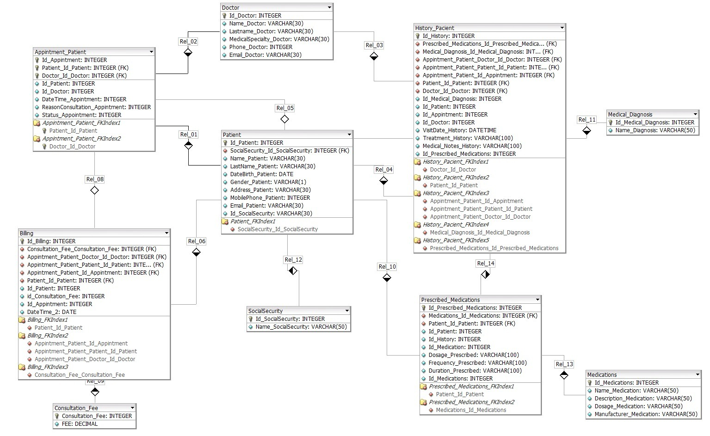
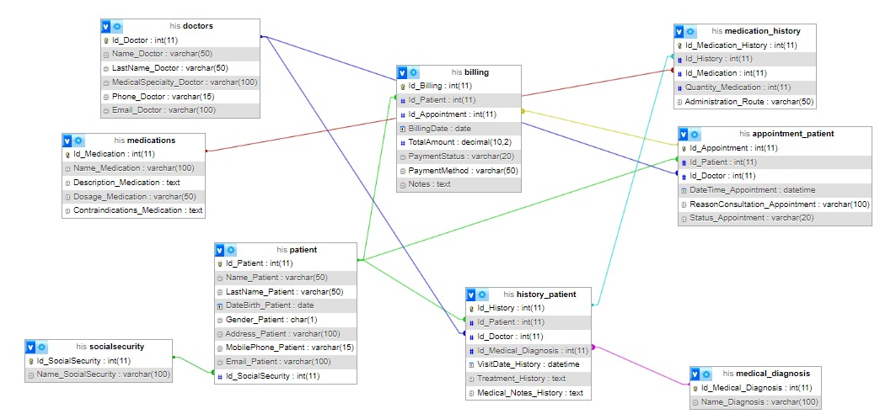
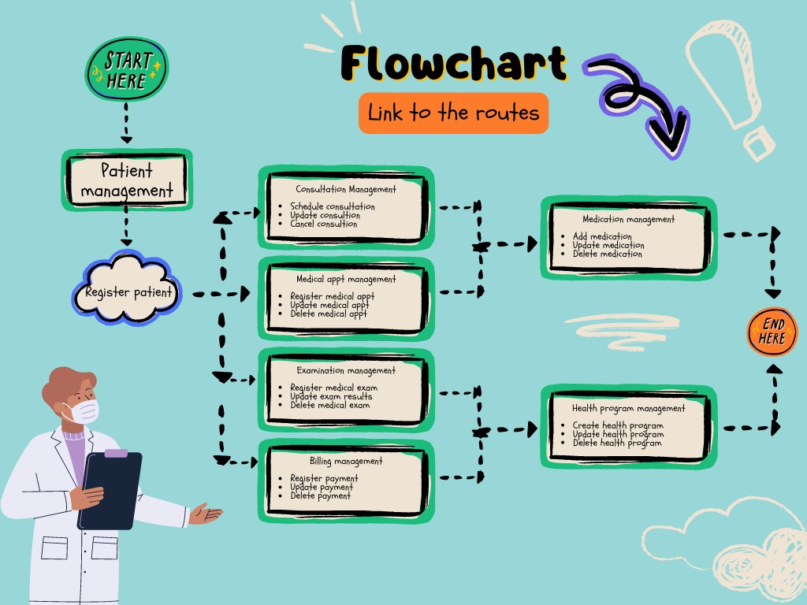

# Company Description

## Company Name
**International Hospital of Santander**

## Company History
The Santander International Hospital (HIS) was created with the aim of meeting the growing healthcare needs in the region by providing high-quality, accessible healthcare services.

## Mission
To offer patient-centered medical care, ensuring a humanized approach and a care environment that promotes recovery and well-being.

## Vision
The International Hospital of Santander is projected as a comprehensive medical center that not only seeks to offer quality care, but also to innovate in the patient experience and contribute to the development of health in the region. It is aligned with international standards, constantly seeking improvement and excellence in all its processes and services.

## Values
- **Humanity**: Prioritizing the well-being and dignity of patients, offering empathetic and compassionate care.
- **Quality**: Commitment to excellence in all services provided, ensuring that the highest standards of healthcare are met.
- **Innovation**: Encourage the adoption of new technologies and practices that improve patient care and optimize internal processes.
- **Integrity**: Act honestly and transparently in all interactions, both with patients and with staff and the community.
- **Social responsibility**: Commitment to the health and well-being of the community, through prevention and health education programs.

## Services
- **Emergencies**: An area dedicated to the immediate attention of medical emergencies.
- **Hospitalization**: Comfortable rooms equipped for the care of patients who require prolonged care.
- **Intensive care**: Specialized units for critically ill patients, with advanced technology for monitoring and treatment.
- **Operating rooms**: Rooms equipped to perform surgeries in various specialties, including general surgery, orthopedics, and oncology.
- **Outpatient consultation**: Outpatient services where patients can receive care without the need for hospitalization.

## Management Team
The International Hospital of Santander has a highly qualified management team, committed to the mission of offering quality and humanized medical care. It has:

- **General Director**: Responsible for the strategic direction of the hospital, ensuring that quality standards are met and best practices in healthcare are implemented.
- **Medical Director**: Oversees the quality of medical care, coordinates clinical services, and ensures that safety and quality protocols are maintained in the treatment of patients.
- **Director of Technology and Information Systems**: In charge of managing the hospital's technological infrastructure, ensuring that the right tools are used to improve efficiency and patient care.
- **Human Resources Director**: Responsible for hiring, training, and staff development, promoting a positive and collaborative work environment.
- **Chief Financial Officer**: In charge of the hospital's financial planning and management, ensuring the economic viability of operations and investment in infrastructure and technology.

# **RUTAS DE LA API**

1\. Register a new patient: 

Route: POST http://localhost:4000/api/pacientes

Description: This route allows a new patient to be registered in the hospital management system.

Parameters:

name: (String) Full name of the patient.

ID: (String) Patient ID or ID number.

fecha\_nacimiento: (String) Date of birth in YYYY-MM-DD format.

Phone: (String) Contact phone number.

address: (String) Residence address.

email: (String) Patient email (optional).

Sample request:

JSON

POST http://localhost:4000/api/pacientes

{

`  `"name": "Juan Pérez",

`  `"cedula": "123456789",

`  `"fecha\_nacimiento": "1985-05-15",

`  `"telephone": "555-1234",

`  `"address": "Calle Falsa 123",

`  `"email": "juan.perez@example.com"

}

2\. Update a patient's information:

Route: PUT http://localhost:4000/api/pacientes/:id

Description: This path allows you to update the information of an existing patient in the system.

Parameters: :id: (String) ID of the patient you want to update. This ID is obtained by registering the patient.

Parameters (optional):

name: (String) New name of the patient.

phone: (String) New phone number.

address: (String) New address.

email: (String) New email.

Sample request:

JSON

Put http://localhost:4000/api/pacientes/1

{

`  `"telephone": "555-5678",

`  `"Address": "Avenida Siempre Viva 742"

}

3\. Eliminate a patient:

Path: DELETE http://localhost:4000/api/pacientes/:id

Description: This path allows you to remove a patient from the system.

Parameters: :id: (String) ID of the patient you want to delete.

4\. Schedule a new consultation: 

Route: POST http://localhost:4000/api/consultas

Description: This route allows you to schedule a new medical consultation for a patient.

Parameters:

paciente\_id: (String) ID of the patient requesting the appointment.

medico\_id: (String) ID of the doctor who will attend the consultation.

Date: (String) Date of the query in YYYY-MM-DD format.

time: (String) Time of the query in HH:MM format.

Sample request:

JSON

POST http://localhost:4000/api/consultas

{

`  `"paciente\_id": "1",

`  `"medico\_id": "10",

`  `"date": "2024-09-15",

`  `"Time": "10:30"

}

5\. Update an existing query

Route: PUT http://localhost:4000/api/consultas/:id

Description: This path allows you to update the details of an existing medical visit.

Parameters: :id: (String) ID of the query you want to update.

Parameters (optional):

date: (String) New date of the query.

Time: (String) New time of the query.

Doctor \_id: (String) New Physician ID.

Sample request:

JSON

PUT http://localhost:4000/api/consultas/1

{

`  `"date": "2024-09-16",

`  `"Time": "11:00"

}

6\. Register a new payment: 

Route: POST http://localhost:4000/api/pagos

Description: This route allows you to record a new payment made by a patient.

Parameters:

paciente\_id: (String) ID of the patient making the payment.

amount: (Number) Payment amount.

metodo\_pago: (String) Payment method (e.g. "card", "cash").

Date: (String) Date of payment in YYYY-MM-DD format.

Sample request:

JSON

POST http://localhost:4000/api/pagos

{

`  `"paciente\_id": "1",

`  `"amount": 150.00,

`  `"metodo\_pago": "card",

`  `"Date": "2024-08-31"

}

7\. Add a new medication: 

Route: POST http://localhost:4000/api/medicamentos

Description: This path allows a new drug to be added to the hospital database.

Parameters:

Name: (String) Name of the medicine.

dosage: (String) Recommended dose.

Description: (String) Medication description (optional).

efectos\_secundarios: (String) Possible side effects (optional).

Sample request:

JSON

POST http://localhost:4000/api/medicamentos

{

`  `"name": "Paracetamol",

`  `"dose": "500 mg",

`  `"description": "Analgesic and antipyretic.",

`  `"efectos\_secundarios": "Nausea, rashes."

}

8\. Obtain consultation history by ID: 

Path: GET /api/queries/cedula/:cedula

Description: This route allows you to obtain the medical consultation history of a specific patient, using their ID number.

Parameters:

:cedula: (String) Patient ID number.

id: (String) Unique ID of the query.

Date: (String) Date of the query in YYYY-MM-DD format.

time: (String) Time of the query in HH:MM format.

doctor: (String) Name of the doctor who attended the consultation.

diagnosis: (String) Diagnosis made during the consultation.

Treatment: (String) Prescribed treatment.

Sample request:

GET /api/queries/cedula/123456789

Sample response:

JSON

[

`  `{

`    `"id": "1",

`    `"date": "2024-08-15",

`    `"time": "10:00",

`    `"doctor": "Dr. Juan Gómez",

`    `"diagnosis": "Flu",

`    `"treatment": "rest and medication"

`  `},

`  `{

`    `"id": "2",

`    `"date": "2024-07-20",

`    `"time": "14:30",

`    `"doctor": "Dr. María Pérez"

`    `"diagnosis": "Back pain",

`    `"treatment": "Physiotherapy and analgesics"

`  `}

]

9\. Get information from a specific doctor:

Path:GET /api/medicos/:id

Description: This route allows you to obtain detailed information about a specific doctor, such as their specialty, experience, and hours of operation.

Parameters:

:id: (String) Unique ID of the doctor.

Name: (String) Doctor's full name.

Specialty: (String) The doctor's medical specialty.

Experience: (Number) Years of experience of the physician.

Hours: (Array) Arrangement with the hours of operation, where each object contains:

day: (String) Day of the week.

hours: (String) Range of hours of service in HH:MM - HH:MM format.

Sample request:

GET /api/medicos/10

Sample response:

JSON

{

`  `"name": "Dr. Juan Gómez",

`  `"specialty": "Internal Medicine",

`  `"experience": 15,

`  `"Schedule": [

`    `{

`      `"day": "Monday",

`      `"hours": "08:00 - 12:00"

`    `},

`    `{

`      `"day": "Wednesday",

`      `"Hours": "14:00 - 18:00"

`    `},

`    `{

`      `"day": "Friday",

`      `"hours": "08:00 - 12:00"

`    `}

`  `]

}

## Developers
- **Melissa Sanabria**
- **Elkin Ortega**
- **Madwin Palacio**
- **Cielo Mariño**

## VIDEO CREATE ROUTES 

Hello everyone! In today's video, we'll learn how to implement GET routes in Visual Studio Code to interact with an API. We'll see how to make requests and retrieve data easily. Join me as we explore the power of APIs together!

https://youtu.be/-ct6pHWOa7Q
